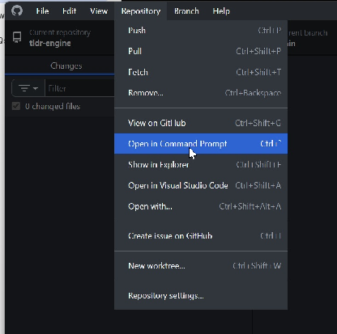

<!-- locale: en-US; content-id: getting-started -->

# Getting Started

## Requirements

Before changing the project, have:

- GitHub and GitHub Desktop;
- at least intermediate GameMaker Studio 2 knowledge;
- familiarity with structs and constructors.

> [!IMPORTANT]
> **Do not start by simply downloading the repository.** The documented setup creates your own repository first and connects the public project as an upstream remote.

## Set up the repository

### 1. Install GitHub Desktop

Install [GitHub Desktop](https://desktop.github.com/download/) if you do not already have it.

### 2. Create your repository

Create a new repository on GitHub:

[Create a repository](https://github.com/new)

Clone **your repository** with GitHub Desktop.

### 3. Open Command Prompt from GitHub Desktop

Use **Repository → Open in Command Prompt**.



Run these commands in order:

```bash
git remote add upstream https://github.com/tweenko/tldr-engine.git
git fetch upstream
git reset --hard upstream
```

### 4. Publish your repository

Publish the repository through GitHub Desktop.

If the publish button is not visible, press **Fetch Origin** first.

After publishing, the local repository is ready for project changes. Commit regularly so later updates have a clean history to merge against.

## Run the project before modifying it

Launch the project once before making large changes.

Run through the available rooms and inspect what is already implemented. After that, open the test/example rooms and see how the behavior you just saw was built.

That is particularly useful because later documentation points back to those examples instead of fully documenting every function signature.

## Constructors are a prerequisite

> [!WARNING]
> A large portion of the project uses GameMaker **constructors**. If structs or constructors are unfamiliar, learn them before modifying party members, enemies, or other constructor-based systems.

## Make the first project changes

Most common base-project changes belong in `o_world`.

The two events called out are:

- **Game Start**
- **Create**

Examples include:

- default items in the player's inventory;
- the default party ensemble;
- project settings.

Constructor definitions do not need to be kept in `o_world`. Create project-specific scripts for families of constructors you add.

## When the documentation is not enough

Check the function's **JSDoc** first.

Then inspect the corresponding example:

- cutscenes: the cutscene example room in `zzz Examples`;
- enemy constructors: `enc_enemies`;
- battle turns: `ZZZexamples > objects > enc > turns`.

If the current code and JSDoc still do not answer the question, use the development-help channels in the [Discord Server](https://discord.gg/x3t8JTyC2p).

## Setup checklist

- [ ] GitHub Desktop is installed.
- [ ] I created and cloned my own repository.
- [ ] `upstream` points to `https://github.com/tweenko/tldr-engine.git`.
- [ ] I ran `git fetch upstream`.
- [ ] I ran `git reset --hard upstream`.
- [ ] I published my repository.
- [ ] The unmodified project runs.
- [ ] I inspected the example/test rooms.
- [ ] I understand structs and constructors before editing constructor-based systems.
