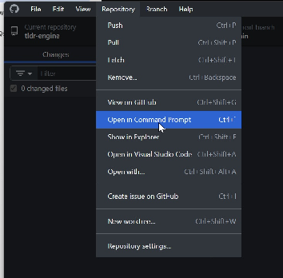

<!-- locale: en-US; content-id: updating -->

# Updating

## Before pulling an update

The documented update flow assumes the repository was set up through the Git workflow in the Getting Started guide.

Commit every change you want to keep before pulling the update.

## Pull the new version

1. Open the repository in GitHub Desktop.
2. Use **Repository → Open in Command Prompt**.



3. Run:

```bash
git pull upstream main
```

Some older setups may use:

```bash
git pull public main
```

instead.

4. Git may open a prompt asking for a merge-commit description. Fill it out and close the file.
5. Open GitHub Desktop and resolve any conflicts.
6. Push the merged changes to your repository's origin.

## Merge conflicts

> [!IMPORTANT]
> Merge conflicts can happen when your project and the incoming update changed the same content. Resolve them one by one instead of discarding one side wholesale.

GitHub Desktop shows which files are conflicted; the original documentation recommends Visual Studio Code for editing them.

Keeping project-specific constructors outside heavily edited engine files reduces the amount of overlap you have to resolve.

If an engine-specific update problem remains after the Git conflict is resolved, use the [Discord Server](https://discord.gg/x3t8JTyC2p).

## Update checklist

- [ ] Changes I want to keep are committed.
- [ ] I am pulling from the remote name configured in this repository (`upstream` or the older `public`).
- [ ] The merge message was completed if Git requested one.
- [ ] Every merge conflict was resolved.
- [ ] Project-specific constructor/configuration changes survived the merge.
- [ ] The merged result was pushed to origin.
- [ ] The project runs after the update.
